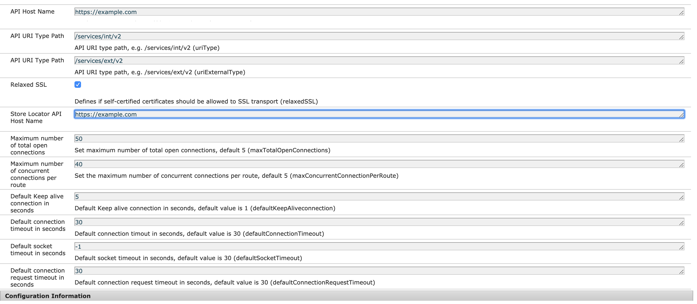

# AEM-REST-Integration
Integrating AEM with REST based end clients

Inorder to Integrate AEM with REST based end points using Relaxed SSL (HTTP or HTTPS)

Please copy above mentioned files

Configure the OSGI config as shown below:

